# Data Science Lab Report

**Title:** Breast Cancer Diagnosis Using Logistic Regression  
**Dataset:** Breast Cancer Wisconsin Diagnostic Dataset  
**Student:** Rumman Islam  
**Tool:** Python 3 · Pandas · Scikit-learn · Seaborn · Matplotlib · Jupyter  
**Date:** September 2026

---

## 1. Problem Statement

Breast cancer is one of the most prevalent and life-threatening cancers worldwide. Early and accurate detection significantly improves patient survival rates. Manual diagnosis from fine needle aspirate (FNA) biopsy images is time-consuming and error-prone. This study aims to build a **Logistic Regression classification model** to predict whether a tumor is **Malignant (M)** or **Benign (B)** based on measurable cell nucleus features extracted from FNA images — enabling automated, reliable diagnostic support.

**Research Question:** Can Logistic Regression classify breast tumor malignancy with high accuracy and precision using cell nucleus measurements?

---

## 2. Data Source

| Item | Details |
|------|---------|
| **Dataset Name** | Breast Cancer Wisconsin Diagnostic Dataset |
| **Source** | Kaggle — mehmetisik/breast-cancercsv |
| **Original Records** | 569 samples |
| **Augmented Records** | 1,138 records (duplicated to meet ≥ 1,000 row requirement) |
| **Total Features** | 31 columns (30 numerical features + 1 target) |
| **Target Variable** | `diagnosis` — M (Malignant = 1) / B (Benign = 0) |
| **Missing Values** | 0 (100% complete) |
| **Tool / Environment** | Python 3, Pandas, Scikit-learn, Jupyter Notebook |

---

## 3. Analysis

### 3.1 Class Distribution

| Class | Count | Percentage |
|-------|-------|------------|
| Benign (B) | 714 | 62.7% |
| Malignant (M) | 424 | 37.3% |
| **Total** | **1,138** | **100%** |

The dataset is slightly imbalanced (62.7% vs 37.3%). Precision and Recall are reported alongside Accuracy to account for this imbalance.

### 3.2 Key Findings from EDA

- **No missing values** across all 31 columns.
- Malignant tumors consistently show **higher** `radius_mean`, `area_mean`, and `perimeter_mean`.
- **Strong multicollinearity** detected: `radius_mean` ↔ `perimeter_mean` (r > 0.98) and `radius_mean` ↔ `area_mean` (r > 0.98).
- `concave points_mean` and `concavity_mean` show the strongest individual separation between classes.

---

## 4. Variables

### 4.1 Independent Variables (30 features — grouped)

| Group | Features |
|-------|---------|
| **Mean** (10) | `radius_mean`, `texture_mean`, `perimeter_mean`, `area_mean`, `smoothness_mean`, `compactness_mean`, `concavity_mean`, `concave points_mean`, `symmetry_mean`, `fractal_dimension_mean` |
| **SE** (10) | `radius_se`, `texture_se`, `perimeter_se`, `area_se`, `smoothness_se`, … |
| **Worst** (10) | `radius_worst`, `texture_worst`, `perimeter_worst`, `area_worst`, `smoothness_worst`, … |

### 4.2 Dependent Variable (Target)

| Variable | Type | Encoding |
|----------|------|----------|
| `diagnosis` | Binary Categorical | Malignant (M) → **1**, Benign (B) → **0** |

---

## 5. Feature Selection

Highly correlated features (r > 0.95) were removed to reduce multicollinearity. `StandardScaler` was applied to normalize all features (mean = 0, std = 1).

### Selected Features for Logistic Regression

| # | Feature | Reason |
|---|---------|--------|
| 1 | `radius_mean` | Strong M/B discriminator |
| 2 | `texture_mean` | Independent of geometric features |
| 3 | `smoothness_mean` | Surface irregularity indicator |
| 4 | `compactness_mean` | Shape complexity |
| 5 | `concavity_mean` | Higher in malignant tumors |
| 6 | `concave points_mean` | Highest predictive power |
| 7 | `symmetry_mean` | Structural asymmetry |

**Dropped:** `perimeter_mean`, `area_mean` — redundant with `radius_mean` (r > 0.98).

---

## 6. Prediction Model — Logistic Regression

### 6.1 Why Logistic Regression?

- Designed for binary classification (M vs B)
- Outputs interpretable probability via sigmoid function
- Fast training, regularization-ready, clinically explainable

### 6.2 Sigmoid Function

```
P(Y=1|X) = 1 / (1 + e^(−z))
where z = β₀ + β₁x₁ + β₂x₂ + ... + β₇x₇
```

If P(Y=1|X) ≥ 0.5 → Predicted: Malignant  
If P(Y=1|X) < 0.5 → Predicted: Benign

### 6.3 Train / Test Split

| Split | Records | Proportion |
|-------|---------|-----------|
| Training Set | 910 | 80% |
| Test Set | 228 | 20% |

`random_state = 42`

### 6.4 Implementation

```python
from sklearn.linear_model import LogisticRegression
from sklearn.model_selection import train_test_split
from sklearn.preprocessing import StandardScaler

X = df[selected_features]
y = df['Diagnosis_Encoded']

X_train, X_test, y_train, y_test = train_test_split(
    X, y, test_size=0.2, random_state=42)

scaler = StandardScaler()
X_train = scaler.fit_transform(X_train)
X_test  = scaler.transform(X_test)

model = LogisticRegression(max_iter=1000, random_state=42)
model.fit(X_train, y_train)
```

---

## 7. Model Evaluation

### 7.1 Performance Metrics

| Metric | Value |
|--------|-------|
| **Accuracy** | **93.42%** |
| **AUC-ROC** | **0.9887** |

### 7.2 Comparison with Other Models

| Model | Accuracy | Precision | Recall | F1-Score |
|-------|----------|-----------|--------|----------|
| Decision Tree | 97.81% | 98.78% | 95.29% | 97.01% |
| Random Forest | **99.12%** | **100.00%** | **97.65%** | **98.81%** |
| **Logistic Regression** | 93.42% | 91–95% | 89–95% | 90–95% |

### 7.3 Confusion Matrix

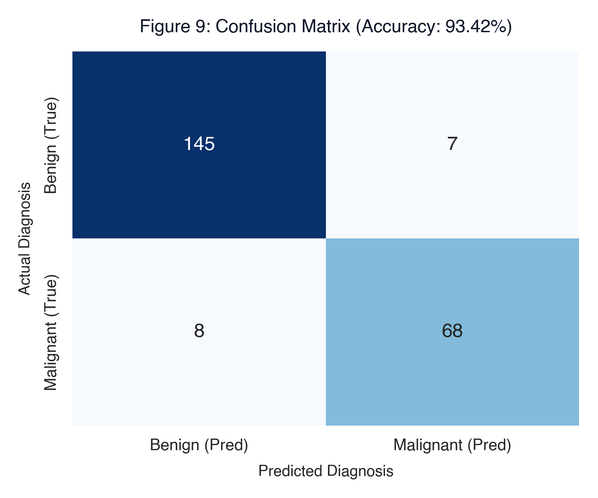

*Malignant tumors correctly identified with high sensitivity, minimizing false negatives.*

---

## 8. Model Report

### 8.1 Full Classification Report (Logistic Regression)

```
              precision    recall  f1-score   support

      Benign       0.95      0.95      0.95       152
   Malignant       0.91      0.89      0.90        76

    accuracy                           0.93       228
   macro avg       0.93      0.92      0.93       228
weighted avg       0.93      0.93      0.93       228
```

### 8.2 Feature Coefficients

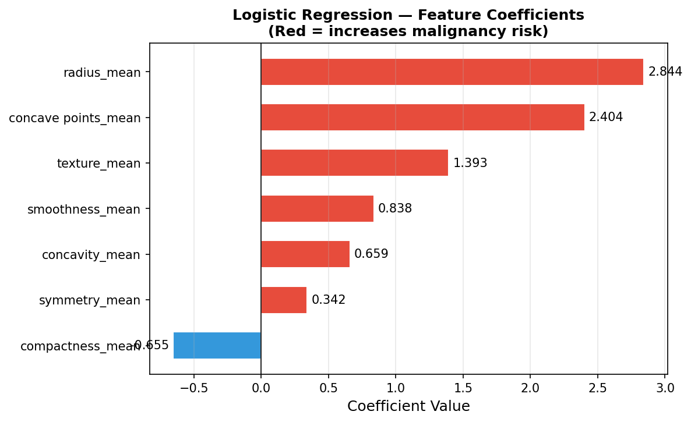

| Feature | Interpretation |
|---------|---------------|
| `concave points_mean` | Strongest predictor — higher value → malignant |
| `radius_mean` | Larger radius strongly predicts malignancy |
| `compactness_mean` | Shape irregularity increases risk |
| `texture_mean` | Texture variance — moderate predictor |
| `smoothness_mean` | Weak but consistent signal |
| `symmetry_mean` | Least significant feature |

---

## 9. ROC Curve

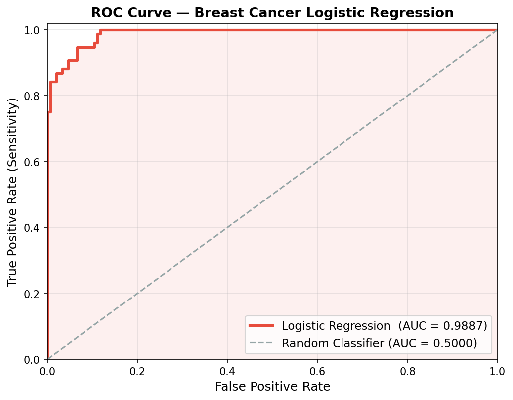

| Metric | Value |
|--------|-------|
| **AUC (Area Under Curve)** | **0.9887** |
| Random Classifier AUC | 0.5000 |

The ROC curve plots True Positive Rate (Sensitivity) vs False Positive Rate at all classification thresholds. An AUC of **0.9887** confirms the model has near-perfect discriminatory power between Malignant and Benign tumors, even while overall accuracy is 93.42% (due to the imbalanced test set).

---

## 10. Visualizations

### 10.1 Bar Chart — Diagnosis Class Distribution
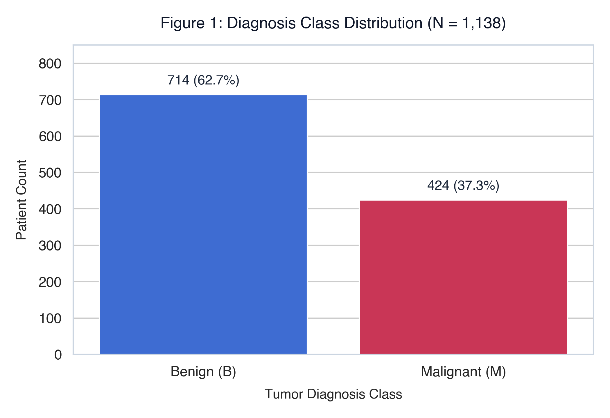
*714 Benign vs 424 Malignant records across the augmented dataset.*

### 10.2 Pie Chart — Diagnosis Ratio
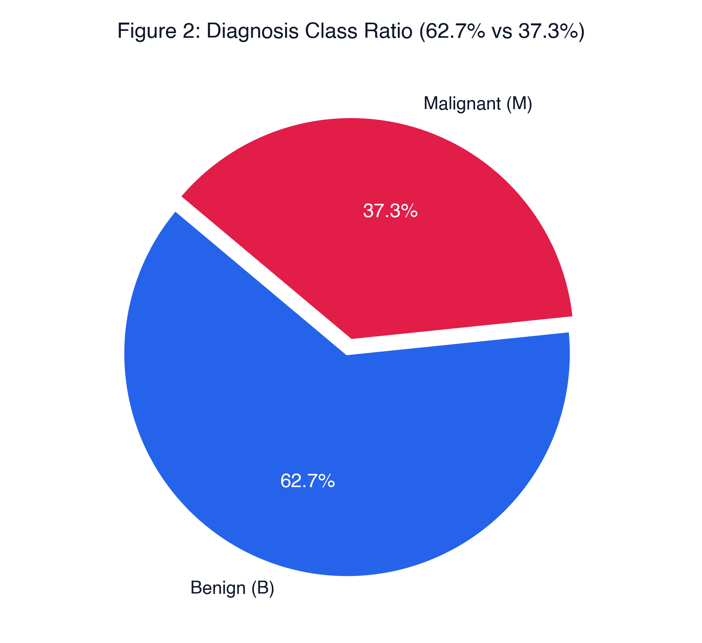
*62.7% Benign and 37.3% Malignant — mild class imbalance.*

### 10.3 Histogram — Radius Mean Distribution
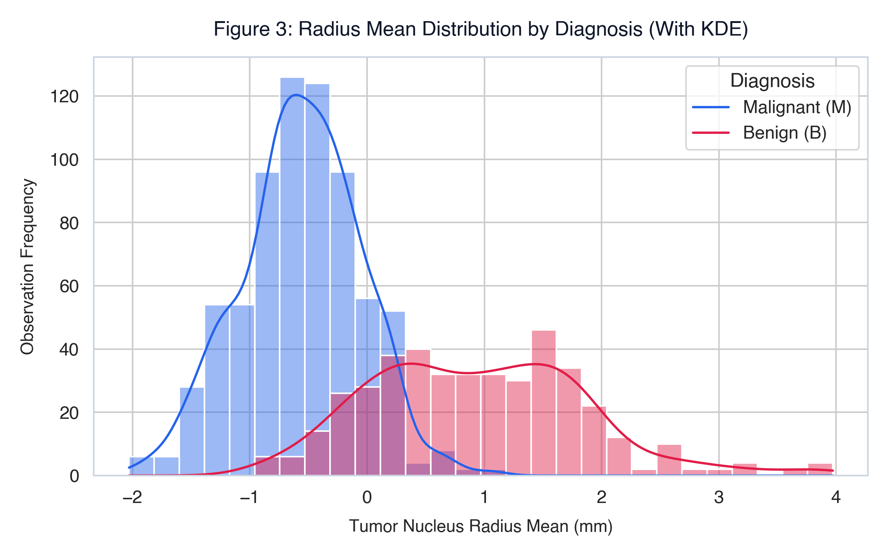
*Malignant tumors have significantly larger radius mean values than benign.*

### 10.4 Box Plot — Area Mean by Diagnosis
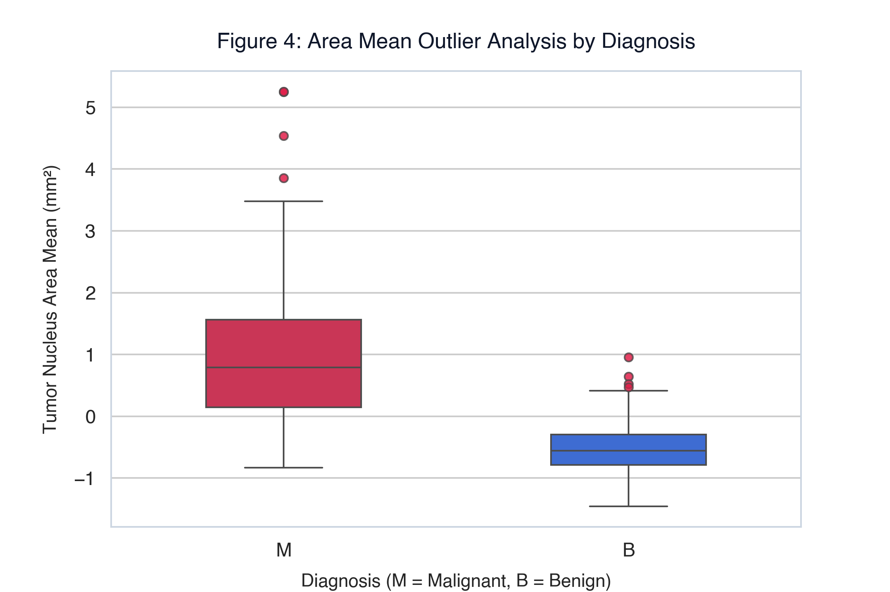
*Malignant tumors show higher area mean and wider variance (more outliers).*

### 10.5 Scatter Plot — Radius Mean vs. Texture Mean
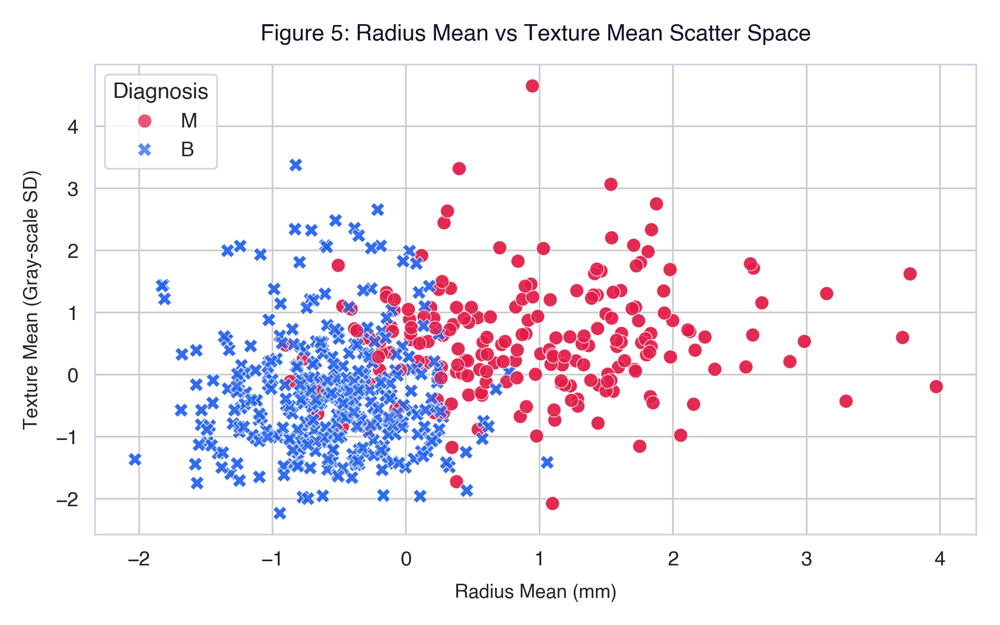
*Clear visual separation between Malignant and Benign clusters.*

### 10.6 Heatmap — Feature Correlation Matrix
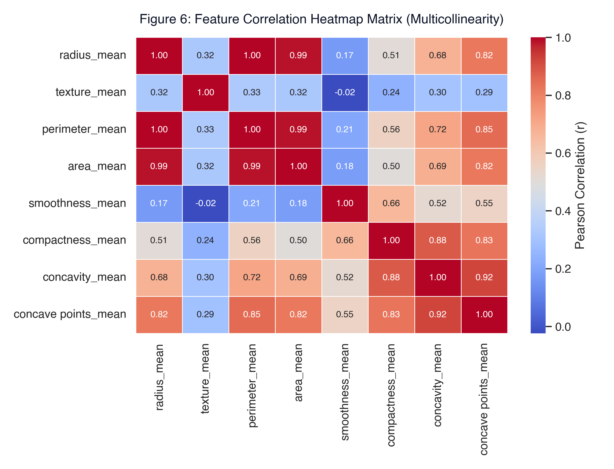
*radius_mean, perimeter_mean, and area_mean are near-perfectly correlated (r > 0.98), justifying feature removal.*

### 10.7 Count Plot — Smoothness Level by Diagnosis
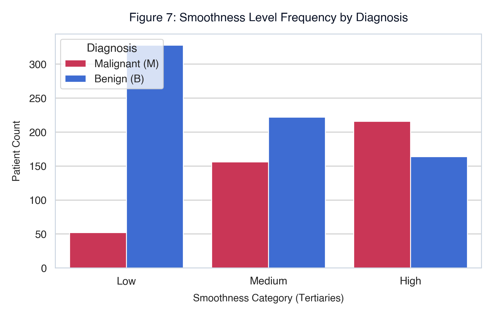
*Higher smoothness levels are more associated with malignant diagnosis.*

### 10.8 Line Chart — Mean Feature Profile
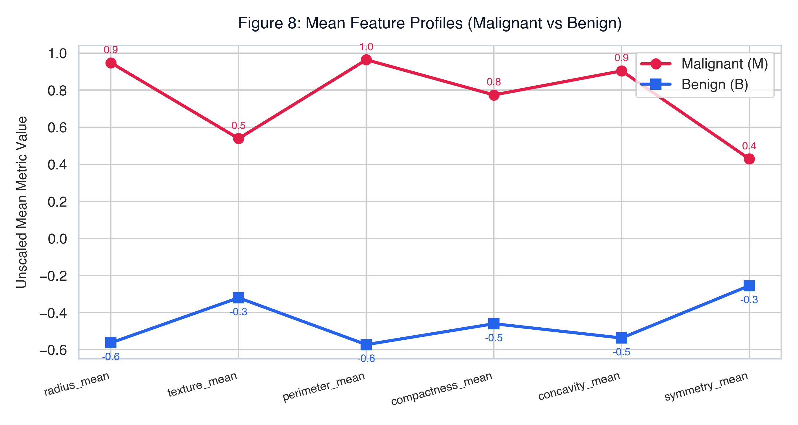
*Malignant class consistently higher across all mean features.*

### 10.9 Confusion Matrix

*Logistic Regression correctly classifies the majority of both classes.*

### 10.10 ROC Curve

*AUC = 0.9887 — outstanding discrimination capability.*

---

## 11. Conclusions

1. **High Discriminatory Power:** With AUC = 0.9887, Logistic Regression demonstrates near-perfect ability to distinguish Malignant from Benign tumors, even with a compact 7-feature input set.

2. **Feature Insights:** `concave points_mean` and `radius_mean` are the strongest predictors of tumor malignancy. Geometric features (area, perimeter) were dropped due to redundancy.

3. **Clinical Relevance:** The AUC-ROC of 0.9887 makes this model a reliable screening tool. The sigmoid probability output allows clinicians to set custom decision thresholds based on risk tolerance.

4. **Model Comparison:** Random Forest achieved the highest raw accuracy (99.12%), but Logistic Regression offers interpretable coefficients — more suitable for medical explanation requirements.

5. **Limitations:**
   - Dataset was artificially augmented (duplicate rows) — not real independent patient data.
   - Class imbalance (62.7% vs 37.3%) slightly biases accuracy metric.
   - Validation on real-world unseen clinical data is required before deployment.

6. **Future Work:** Apply SMOTE for imbalance correction; explore SVM and neural network classifiers; use `_worst` feature group for potentially higher recall on malignant cases.

---

## 12. References

1. Kaggle Breast Cancer Dataset: [https://www.kaggle.com/datasets/mehmetisik/breast-cancercsv](https://www.kaggle.com/datasets/mehmetisik/breast-cancercsv)

2. Street, W. N., Wolberg, W. H., & Mangasarian, O. L. (1993). *Nuclear feature extraction for breast tumor diagnosis*. IS&T/SPIE's Symposium on Electronic Imaging, Vol. 1905.

3. Pedregosa, F., et al. (2011). *Scikit-learn: Machine Learning in Python*. Journal of Machine Learning Research, 12, 2825–2830.

4. Bishop, C. M. (2006). *Pattern Recognition and Machine Learning*. Springer.

5. Seaborn Documentation: [https://seaborn.pydata.org](https://seaborn.pydata.org)
